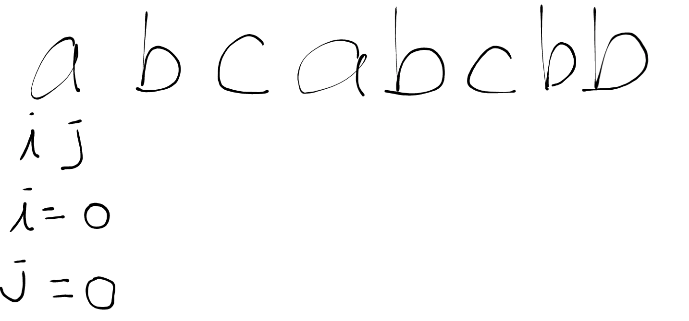
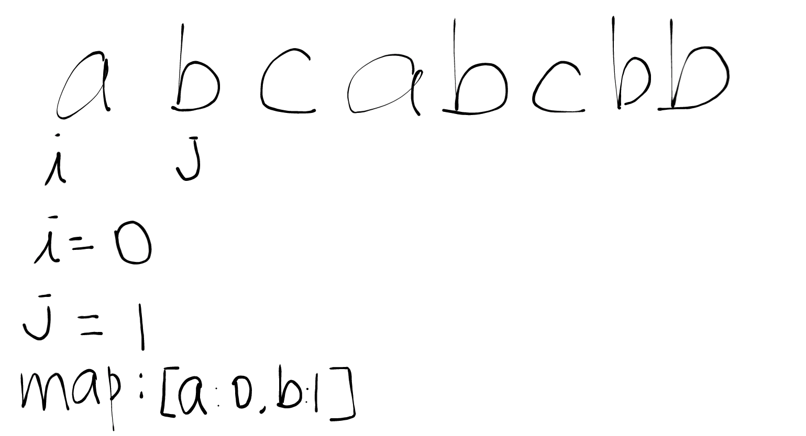
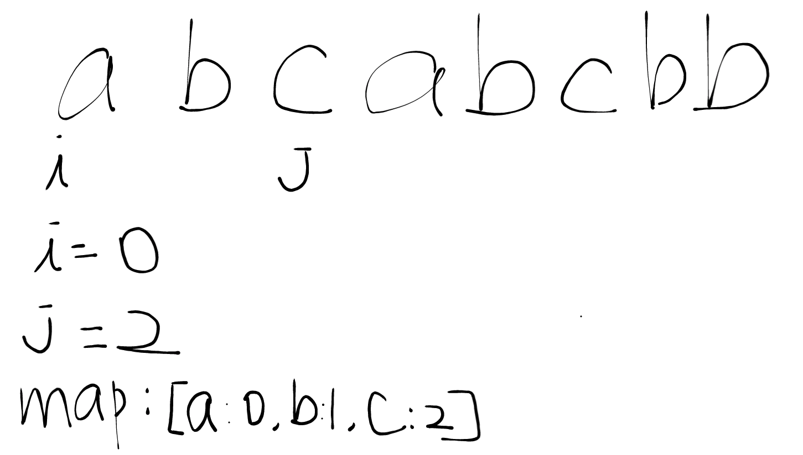
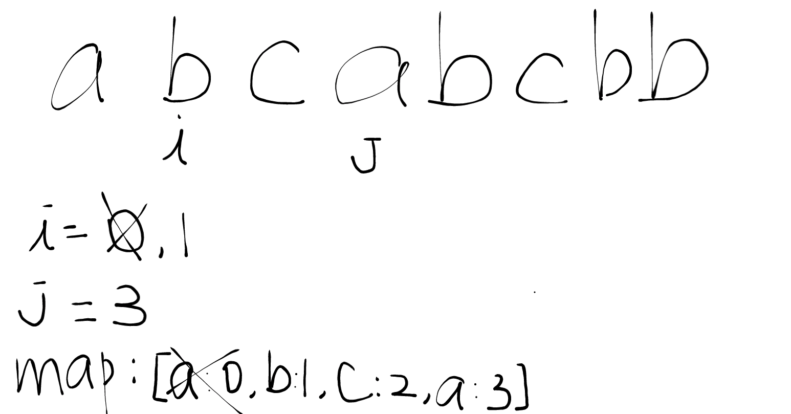
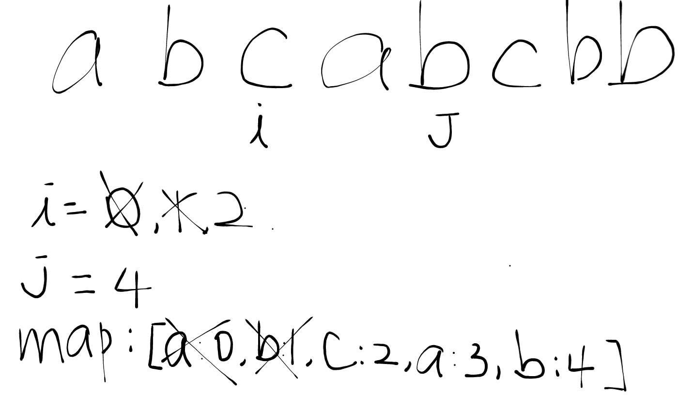

# Longest non repeated substring

Given a string, find the length of the longest substring without repeating characters.

**Example 1**

```
Input: "abcabcbb"
Output: 3
Explanation: The answer is "abc", with the length of 3.
```

**Example 2**

```
Input: "bbbbb"
Output: 1
Explanation: The answer is "b", with the length of 1.
```

**Example 3**

```
Input: "pwwkew"
Output: 3
Explanation: The answer is "wke", with the length of 3. 
             Note that the answer must be a substring, "pwke" is a subsequence and not a substring.
```

## What is a substring

From the dipiction of the problem. a substring is contiguous series of characters. There are no repeated characters in the substring.

## Approach

We are going to use two indicators `i` and `j` to slide the window to find the longest non repeated substring.

We use a hashmap to keep on tracking whether a repeated character has been found in the given substring.

For example of string `abcabcbb`, we use `str` to indicate the string:

### 1st Iteration



On our first iteration. `i = 0` and `j = 0`. Since `str[j]` has no presence in the hashmap, we place `str[j]` along with it's position as value in the hashmap and `j++`.

## 2nd Iteration

`i = 0` and `j = 1`. `str[j]` is `b`. `b` does not exist in the hashmap. We place `b` in the hashmap and it's position in the hashmap. continue on.




## 3rd Iteration

`i = 0` and `j = 2`. `str[j]` is `c`. `c` does not exist in the hashmap. We place `c` in the hashmap and it's position. continue on.



## 4th Iteration

We are at `i = 0` and `j = 3`. `str[j]` is `a`. `a` exists in the hashmap. We do following things

  - Delete `a` from hashmap
  - Slide `i` to the position of `i = map[str[i]] + 1`. In this case, `i` becomes 1 which is `b`
  - Added `a` back to the hashmap along with it's position.



Continue on the iteration after the above steps.

## 5th Iteration

We are at `i = 1` and `j = 4`. `str[j]` is `b`. `b` exists in the hashmap. We repeated the above steps.

  - Delete `b` from hashmap
  - Slide `i` to the position of `i = map[str[i]] + 1`. In this case, `i` becomes 2 which is `c`
  - Added `b` back to the hashmap along with it's position.



We proceed the steps dipicted above until we reach the end of `str`.

Note that at each iteration, we need to track the size of the hashmap. if the current size of the hashmap is greater than the current max. we set the number of the current max to be the size of the hashmap:


```golang
if currMax < len(hashMap) {
  currMax = len(hashMap)
}
```

We can simply return `curMax` after `str` iteration.

## About the hashmap

It is very important that we also place the position of the number as value when we store a number in the hashmap. For example

```golang
hashMap[1] = 0
hashMap[2] = 1
```

Since we need to slide `i` to the next position where `str[j]` is previously found. So if `str[j]` is previously found at position `1`, then we need to slide `i` to position `1 + 1` which is 2.