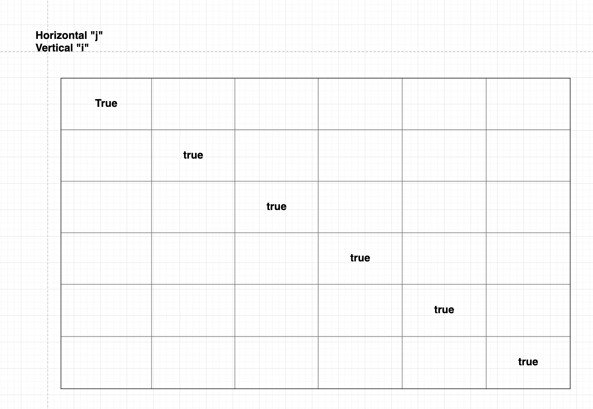
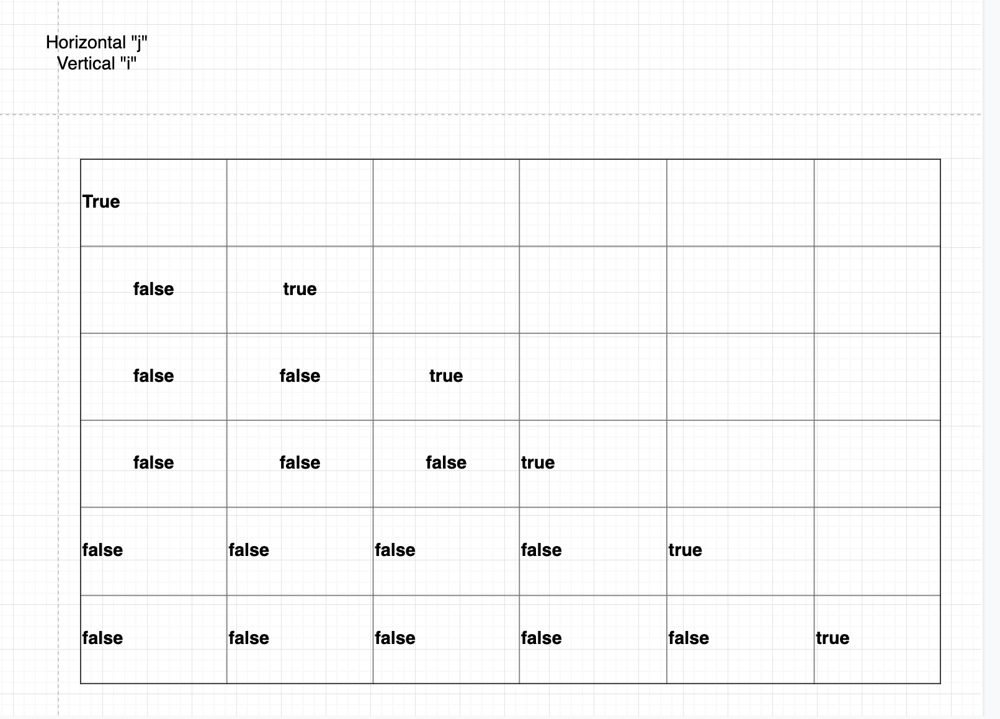

# Longest palindromic substring

Before we delve into the problem itself, we first have to understand what the question is asking for. What is a palindromic and what is substring.

## Palindromic

Given a word, phrase or sequence of value, read it from the beginning of the sequence is the same as read it from backwards. For example:

  **aba** is palindromic.
  **abc** is not a palindromic
  **abba** is a palindromic

## Substring

By definition of wiki **A substring is a contiguous sequence of character within a string**. For example, given a string **palindromic**.

- "pal" is substring of "palindromic"
- "dromi" is a substring of "palindromic"
- "palic" is not a substring of "palindromic", it is a subsequence.

## The problem

We will be using bottomup dynamic programming to construct our solution from the previous solution that is stored in the table.

We will first initialize a 2 dimensional array to store the check result of a palindromic substring for a given length of substring. Given string: `abacab`

For example, The `table[0][2]` indicates substring `aba`. Since `aba` is a palindrom, thus `table[0][2] = true`.

Single character is always a palindrome. Thus, `table[i][j]` is always going to be `true` for every `i = j`:



```go
rune1 := []rune(s)

for i := 0 i < len(s); i++ {
  for j := 0; j < len(s); j++ {
    if i == j {
      table[i][j] == true
    } else {
      table[i][j] == false
    }
  }
}
```

Next, we consider the case for all substrings when length = 2.

```
table[0][1]: ab ---> false
table[1][2]: ba ---> false
table[2][3]: ac ---> false
table[3][4]: ca ---> false
table[4][5]: ab ---> false
```

Since none of the substring above are palindrome, thus, the coordinate described above should be set to `false`.

```
table[i][j] = true if rune1[i] == rune1[i+1]
```



Next, we consider the case for all substrings when length = 3.

```
table[0][2]: aba ---> true
table[1][3]: bac ---> false
table[2][4]: aca ---> true
table[3][5]: cab ---> false
```

We observe that the previous stored solution for `aba` is at `table[1][1]` which is substring `a`. `table[1][1]=true`.

From the above cases we can sort out a golden rule to determine whether a given substring is a palindrome or not:

```go
if rune1[i] == rune1[j] && table[i+1][j-1] == true {
  table[i][j] == true
}
```

Thus, we can construct the algorithm as follow:


```go
for l := 2; l < len(s); l++ {
  for i := 0; i <= len(s)-l; i++ {
    j = i + l

    if rune1[i] == rune1[j] && table[i+1][j-1] == true {
      table[i][j] = true
    }
  }
}
```

The reason that why the second loop should deduct `l` is becasue we need to makesure there is enough room for the last substring. For instance of length of 3 substring for string `abacab` are:

```
- aba ---> i at 0
- bac ---> i at 1
- aca ---> i at 2
- cab ---> i at 3
```

There isn't a substring of length = 3 when `i` is at 4 other wise it would be out of bound. Index at 3 is the last substring of length = 3 for `abacab`.

## Reference

[LPS](https://www.youtube.com/watch?v=Fi5INvcmDos&list=LLD6TArYFl0NO-4yNTxkQWAg)
